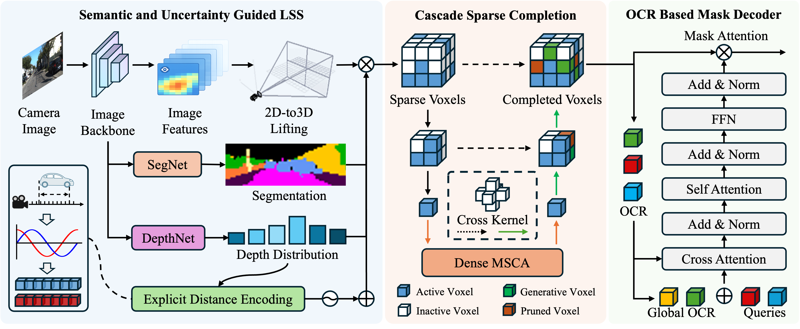

  
# SUGOcc: An Explicit Semantics and Uncertainty Guided Sparse Learning Framework for Real-Time 3D Occupancy Prediction 

## News

## Table of Contents
- [Method](#method)
- [Getting Start](#getting-start)
- [Results](#results)
- [Citation](#citation)
- [Acknowledgements](#acknowledgements)

## Method

 Overview of the proposed SUG-Occ framework.

## Getting Start (Coming Soon)
### Installation
### Data Preparation
### Train & Evaluate

## Results
#### Results on SemanticKITTI

| Model | Backbone | mIoU | FPS | Config | Weights|
|:----------:|:----------:|:----------:|:----------:|:----------:|:----------:|
| SUGOcc| ResNet-50 | 14.91 | 10.1 | [config](projects/SUGOcc/configs/sugocc_kitti.py) | [weights](https://github.com/tlab-wide/SUGOcc/releases/download/V1.0/sugocc_kitti.pth) |

#### Results on Occ3D-Nuscenes
coming soon

## Citation

## Acknowledgements
Many thanks to these excellent projects:
- [OccFormer](https://github.com/zhangyp15/OccFormer)
- [SparseOcc](https://github.com/VISION-SJTU/SparseOcc)
- [ProtoOcc](https://github.com/SPA-junghokim/ProtoOcc)
- [ALOcc](https://github.com/cdb342/ALOcc)
- [MaskDINO](https://github.com/IDEA-Research/MaskDINO)
